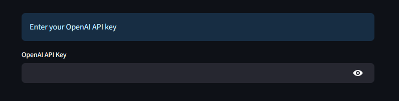
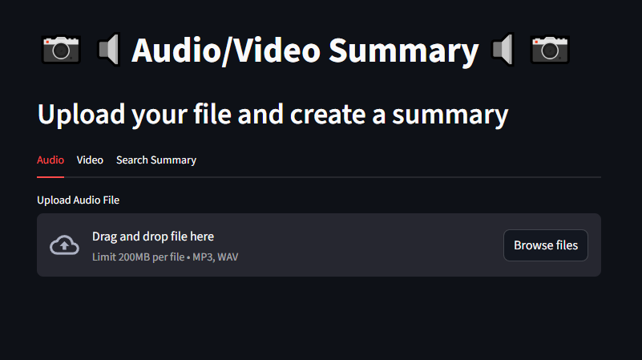
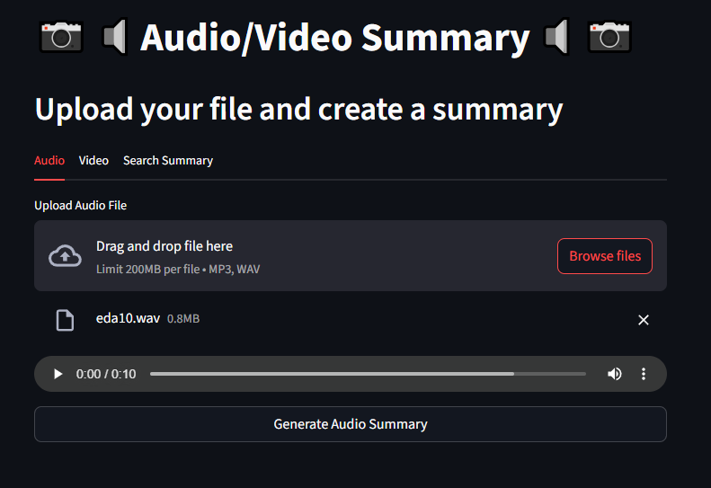
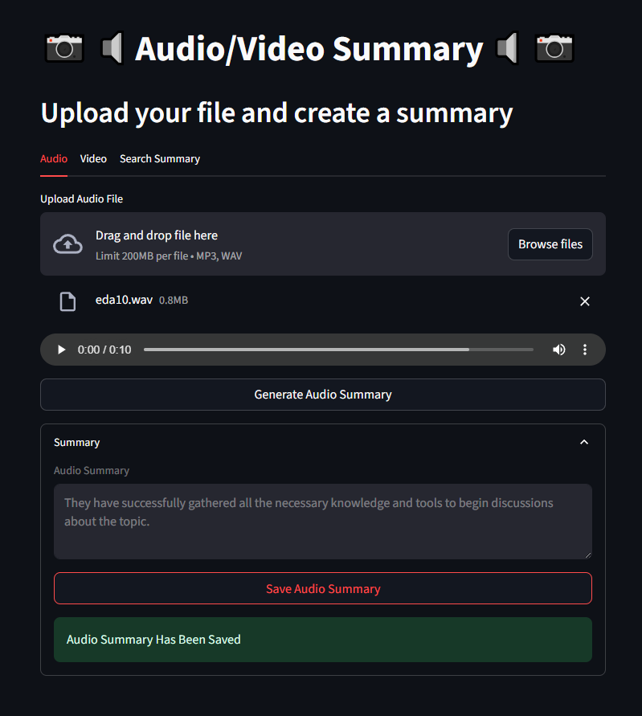
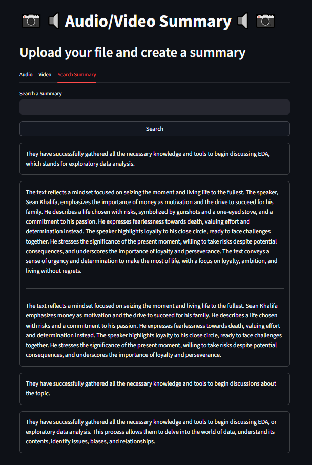
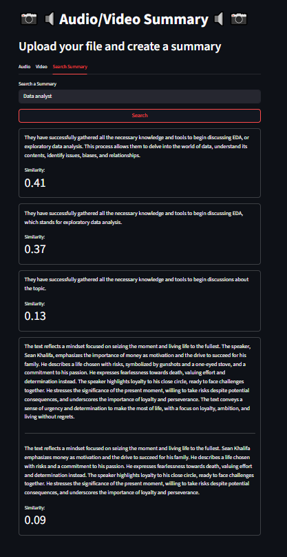

# Audio/Video Summary App with Semantic Search

## Project Description

This app allows you to summarize audio and video files. You can upload a file, get a short and clear summary in English, and save it for later. You can also search through your saved summaries using smart, meaning-based search. The app uses **Streamlit** for the user interface, **OpenAI** for transcription and summaries, and **Qdrant** to store and search summaries.

## Features

- Upload audio (mp3, wav) and video (mp4) files.
- Automatically turn speech into text.
- Summarize the text and translate it into English.
- Save the summary in a **Qdrant** database.
- Search saved summaries using semantic similarity.

## Technologies

- `streamlit` - web app,
- `pydub` - works with audio files,
- `openai` - transcribes, summarizes and creates embeddings,
- `qdrant-client` - stores and searches summaries,
- `dotenv` - loads secrets from a file,
- `hashlib` - detects if a file has been changed. 

## Project Structure

- audio_video_summary
    - images 
        - first_look.PNG
        - no_query_search.PNG
        - openai_key.PNG
        - query_search.PNG
        - summarised_and_saved.PNG
        - uploaded_file.PNG
    - app.py
    - *.env*
    - packages.txt
    - requirements.txt
    - readme.md

## Running the Application (Streamlit Community Cloud)

The app has been deployed using Streamlit Community Cloud: [Click here and try](https://audiovideosummaryapp.streamlit.app/)

## Running the Application (local)

- Open `app.py` and project's folder in VSCode.
- Open the terminal with *CTRL + Shift + `*.
- Create a Conda environment using Python version 3.11: `conda create -n env_name python=3.11`.
- Add conda-forge channel: `conda config --append channels conda-forge`.
- Activate the Conda environment: `conda activate env_name`.
- Install required packages from the requirements.txt file:
    - `cd path_to_project_folder`
    - `pip install -r packages.txt`
    - `pip install -r requirements.txt`
- Create *.env* file and add:
    - QDRANT_URL=your_qdrant_url
    - QDRANT_API=your_qdrant_api_key
- Save.
- Run the app by `streamlit run app.py`.

## How to Use the App

- Enter your `OpenAI API Key` (the key is only stored in session state memory and is not shared or saved anywhere, refreshing the app deletes the key from session state).

- Go to the `Audio` or `Video` tab.

- Upload your file.

- Click `Generate Summary`.
- Click `Save Summary` to send it to the Qdrant database.

- Go to the `Search Summary` tab to search saved notes:
    - Leave the search box empty to view the 10 recent summaries.

    

    - Sending a query will display the most similar summaries by comparing cosine similarity between the summary vectors and the input query vector.

    

## Possible improvements

- Export summaries to the text or PDF file.
- Allow users to record their own audio directly in the app.

## Packages

- ffmpeg (required by `pydub`)

## Requirements

- streamlit
- openai
- pydub
- qdrant-client
- python-dotenv